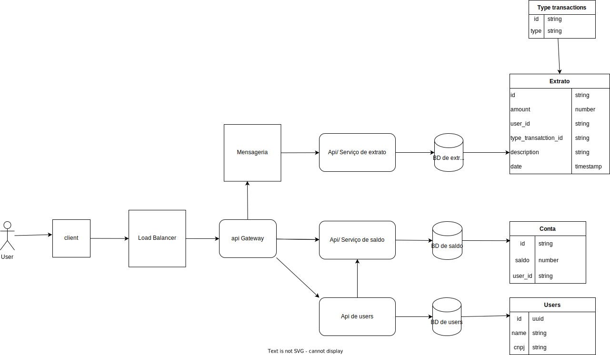

## Sobre o projeto
Desafio técnico onde o objetivo é uma solução para servir um aplicativo de Carteira Digital que o cliente pode consultar seu extrato e saldo

## Pré-requisitos:
- A aplicação deverá fornecer uma API REST com Swagger integrado com endpoints para consulta de saldos e extrato, além das operações de alteração de saldo.
- Ao utilizar o banco de dados de sua preferência, lembre-se da persistência dos dados.
- Se aplicável, migrations deverão ser escritas em SQL.
- Desenvolver os testes unitários do projeto;
- Será um diferencial o desenvolvimento de testes integrados;
- Deverá ser distribuída em containers Docker;
- Deverá ser criado o desenho de arquitetura da solução (incluir no README do projeto);
- Deverá ser disponibilizado em um repositório Git.

## Requisitos:
  - uma solução para servir um aplicativo de Carteira Digital (Wallet)
  - Endpoint de saldo:
    - consulta  
    - operações de alteração de saldo (update):
  - Endpoint de extrato:  
    - onde seja possível receber eventos de: 
      - Adição de Valores, 
      - Retirada de Valores, 
      - Compras, 
      - Cancelamento 
      - Estorno.
  - Considere que esse eventos podem: 
    - vir de diversos canais 
    - em grandes volumes 
    - inclusive em duplicidade.
  - Considere que essa é uma solução baseada em microsserviços.

## Tecnologias utilizads
 - Node
 - Typescript
 - TypeOrm
 - PostgreSQL
 - Jest
 - Swagger
 - Kafka
 - Nginx

## Solução
Desenvovi uma aplicação baseada em microsserviços e eventos onde tem um api gateway que integra com os outros serviços de user, extrato e saldo:
 - A api de user é responsavel por criar o usuario e habilitar seu saldo bancario.
 - A api de extrato funciona através de eventos, cada vez que tem uma alteração no saldo, um evento é disparado para ficar registrado no extrato.
 - a api de saldo é responsavel por atualizar e disponibilizar o saldo.

## Instalação
  Com docker (https://www.docker.com/):
    na pasta principal tem um arquivo docker-compose, utilizar o comando:
      - docker-compose up (a aplicação ja estara disponivel após finalizar)
  
  Sem docker:
    entrar na pasta de cada api (gateway, user, saldo e extrato) e rodar os seguintes comandos:
      - npm install 
      - npm run dev
  serviços de bando de dados, kafka e ngix será preciso instalar localmente
  https://nginx.org/en/
  https://www.postgresql.org/
  https://kafka.apache.org/

  Comandos para test
  npm test

  Comando para build
  npm run build

## Docs de cada api
  - api-gateway: http://localhost:3000/docs/
  - api-saldo: http://localhost:3001/docs/
  - api-extrato: http://localhost:3002/docs/
  - api-user: http://localhost:3003/docs/

